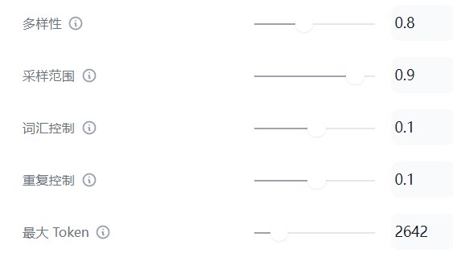

# ppt2script

## Get started

1. Change the API key in "./API/headers.json"

   ```json
   {
       "Authorization": "Bearer YOUR-KEY-HERE", 
       "Content-Type": "application/json" 
   }
   ```

2. Set the sup-parameters in Dify:

   


## How to use

### "POST"

> "/upload"

- Only allow ".pptx", ".ppt"
- Can take a long time (~10s/slide on avarage)


### "GET"

> "/health_status"

+ Check whether the server is still running


>  "/self_check"

+ Check the whole server step-by-step
+ It will automatically parse a .pdf file and upload the text to Dify, then get the response from  ChatGPT(or other LLMs in Dify).


## To-do list

- [x] Add health status checkpoint
- [ ] Add more character styles(e.g. "--style 'lecturer'")
- [ ] Convert the other elements of each slide to text(Group,Graphic)
- [ ] Make the cohesion of the speech more natural and smooth (By using prompt)


## Others

### File Tree & Description

```python
ppt2script:.
│  .gitlab-ci.yml
│  Dockerfile # Build docker
│  help.md
│  ppt2text.py # Convert the slides into text (Only if the slide has text_frame!)
│  prompt.md
│  prompt2.md # The prompt for each pages("opening", "ending", ...)
│  pts.py # Main function: Determine the pages and send to Dify; Storage and return the results
│  README.md
│  requirments.txt
│  role.md # Add different roles or script styles
│  server.py # Flask server
│  start_server.sh # Start the Flask
│  testmain.ipynb
│  testserver.py
│  xgpt.py # Post the ppt in text format to Dify and get response; Formulate the results into target form
│  
├─API # Store the API key in Dify,need to be changed when API expired or tokon depleted
│      headers.json
│      headers.json_bak2
│      
├─data # datetime & slides.ppt(pptx),script.json
│  ├─20230904100906 
│  │      script_商务端操作出货培训.pptx.json
│  │      商务端操作出货培训.pptx
│  │      
│  ├─20230904114111
│  │      ASPICE流程及工具.pptx
│  │      script_ASPICE流程及工具.pptx.json
|  │
│  ├─self_check
|		  check.pptx # For self-check
|		  check_script.json
│          
└─__pycache__
        
```

